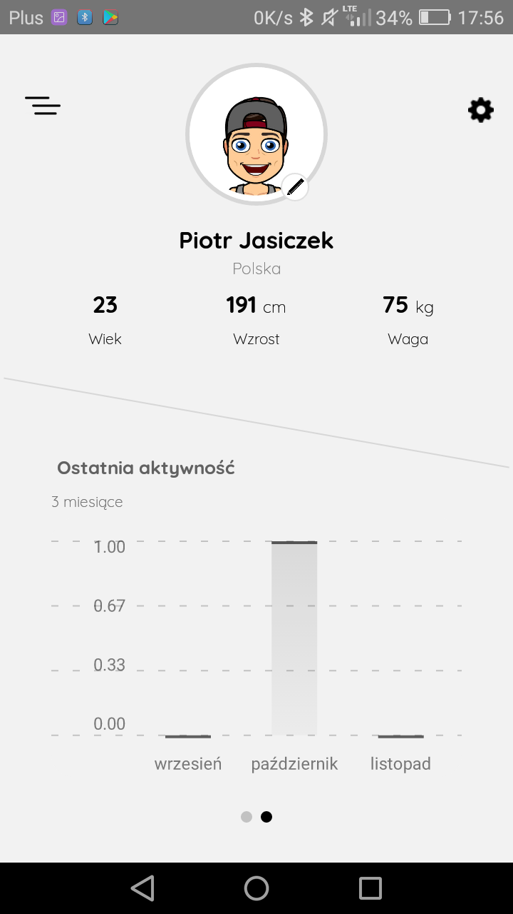
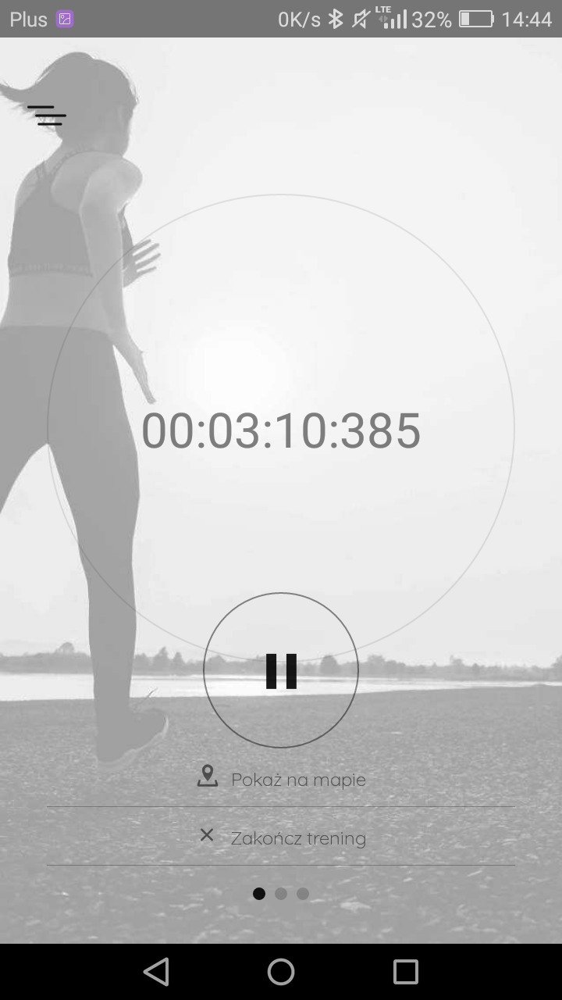
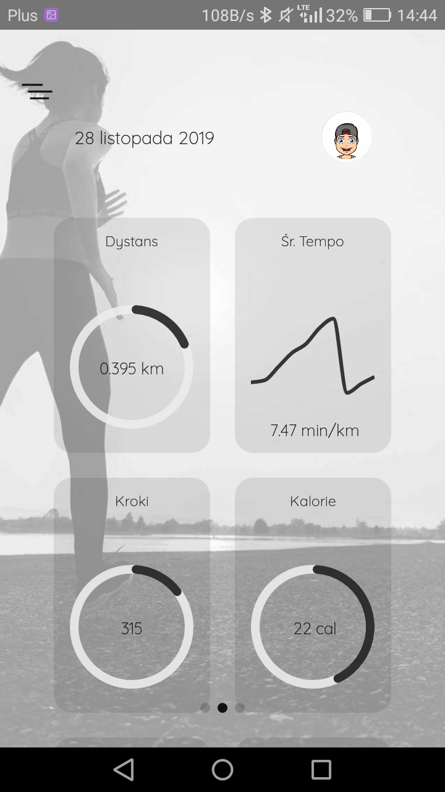
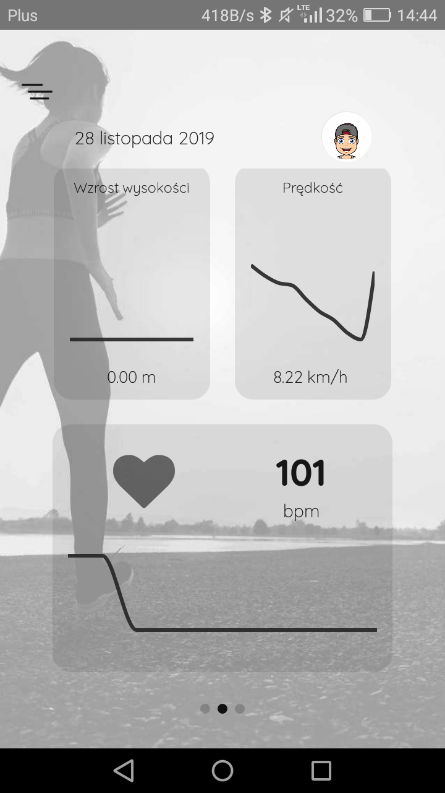
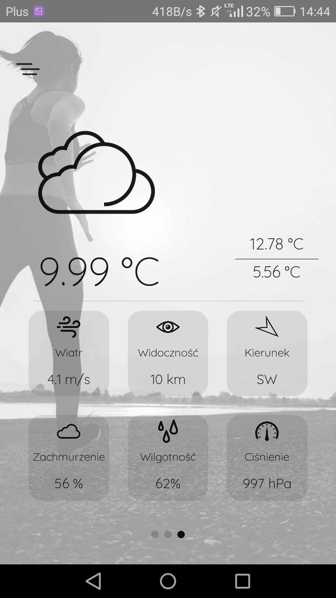
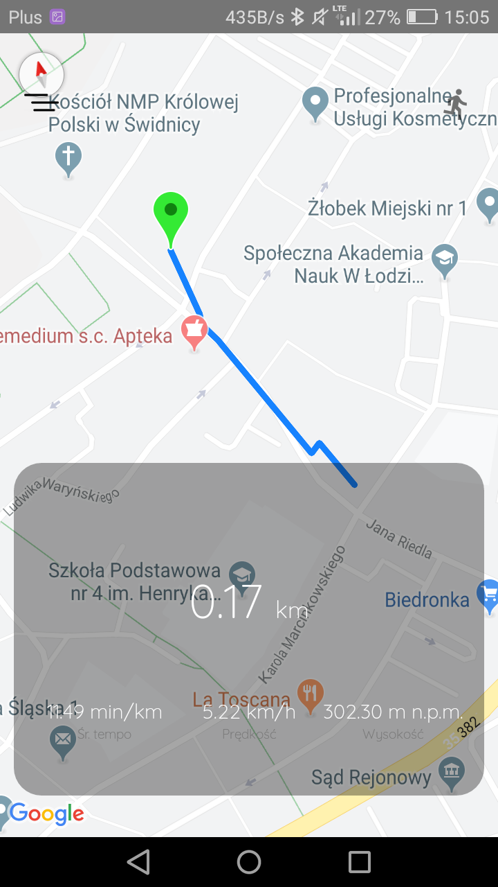

# react-smart-activity-app
>  Design of a mobile application using a sports band to monitor physical activity parameters from various types of sport disciplines with the possibility of setting individual user goals at the start of training.

## Table of contents
* [Technologies](#technologies)
* [Setup](#setup)
* [Screenshots](#screenshots)
    * [User panel](#user-panel)
    * [Activity info](#activity-info-1)
    * [Activity info](#activity-info-2)
    * [Stopwatch](#stopwatch)
    * [Weather](#weather)
    * [Activity route](#activity-route)
* [Contact](#contact)

## Technologies
   To build the mobile application, the React Native framework version 0.60.4 created and still developed by Facebook was used. It allows you to create applications for iOS and Android in JavaScript.
   
   The project also uses PHP in a version higher than version 5.4.45. It was implemented with the help of its API, providing resources and functionalities allowing for the placement and use of data stored in the MySQL relational database version 5.6.37-82.2. To test the functionality of the application, access to hosting containing one 2 GB MySQL database was purchased.

## Setup

### Generating the release APK
```
$ cd android
$ ./gradlew bundleRelease
```
### Testing the app
```
$ react-native run-android --variant=release
```
## Screenshots
### User panel


### Activity info


### Activity info


### Stopwatch


### Weather


### Activity route


## Status
Project is: _in progress_.

## Contact
Created by [@PJasiczek](https://piotrjasiczek.pl/) - feel free to contact me!
