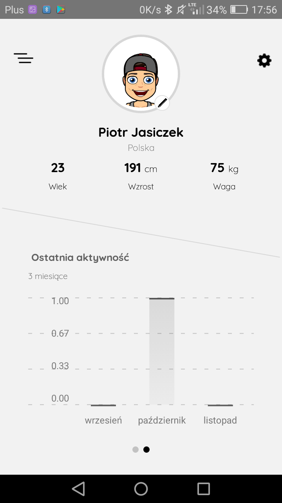
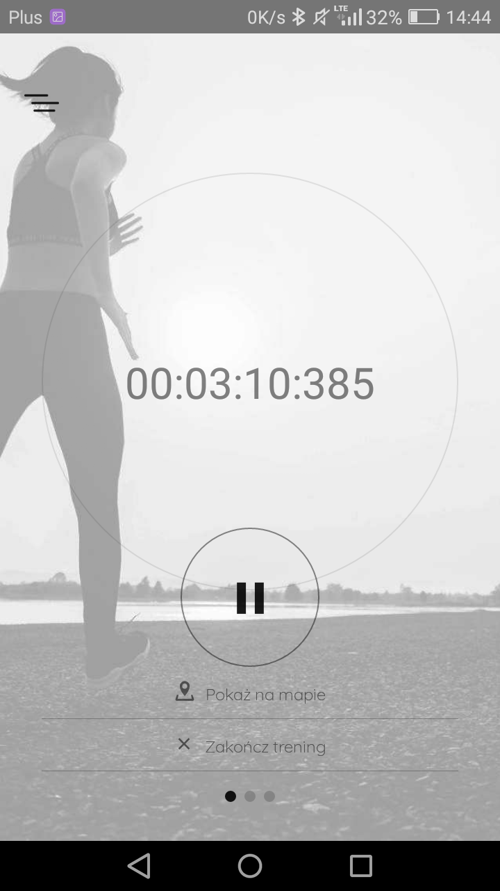
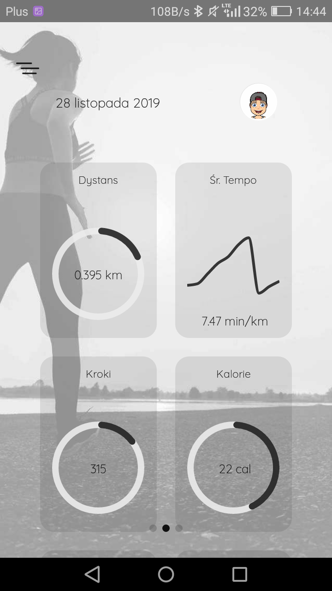
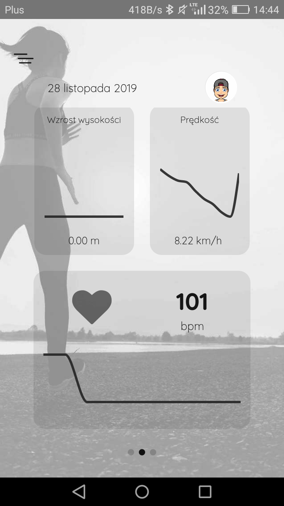
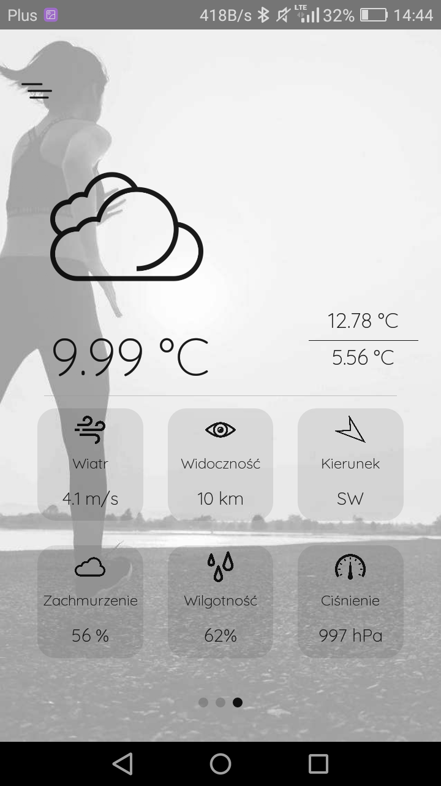
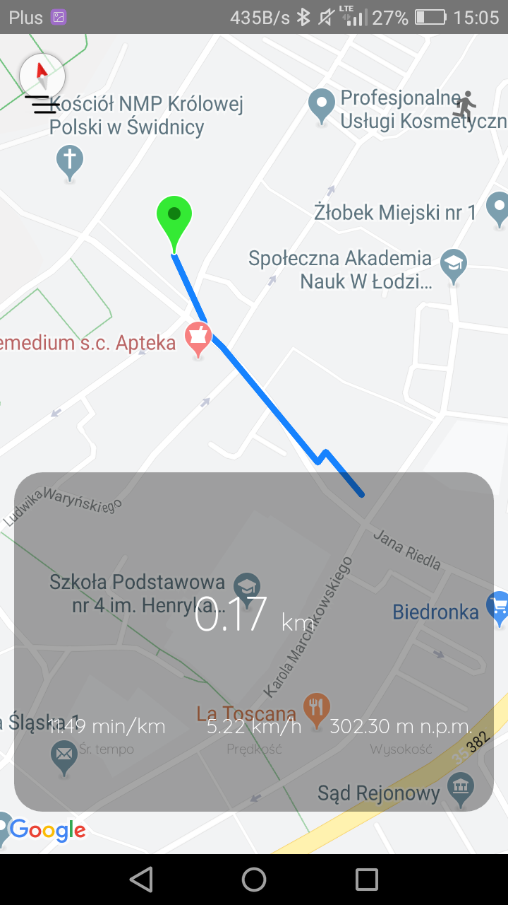

# react-smart-activity-app
> A React Native mobile app for tracking physical activity via a fitness band — connects to a Mi Band 4 over Bluetooth to log workouts, and adds weather and GPS route data, with configurable training goals. Originally developed as my engineering thesis project.

## Table of contents
* [Technologies](#technologies)
* [Features](#features)
* [Setup](#setup)
* [Screenshots](#screenshots)
    * [User panel](#user-panel)
    * [Activity info](#activity-info-1)
    * [Activity info](#activity-info-2)
    * [Stopwatch](#stopwatch)
    * [Weather](#weather)
    * [Activity route](#activity-route)
* [Status](#status)

## Technologies
* React Native 0.60.4 — a single JavaScript codebase targeting both iOS and Android
* A PHP/MySQL REST backend — see [smart-activity-app-api](https://github.com/PJasiczek/smart-activity-app-api)

## Features
* Bluetooth connection to a Mi Band 4 to pull workout data
* Multiple activity/workout types, with per-activity details (including heart rate)
* Activity history and stopwatch
* Weather and GPS route shown alongside a workout
* Account registration and login, with input validation

## Setup

### Generating the release APK
```
$ cd android
$ ./gradlew bundleRelease
```
### Testing the app
```
$ react-native run-android --variant=release
```

## Screenshots
### User panel


### Activity info


### Activity info


### Stopwatch


### Weather


### Activity route


## Status
**On hold** — not currently under active development.

Built between mid-2019 and early 2020 as my engineering thesis project.
